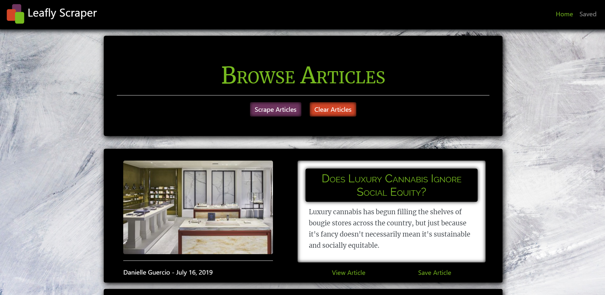

# Article-Scraper

<a href="https://leafly-scraper-treez.herokuapp.com/" target="_blank">Leafly Scraper</a>

## About 📖
Leafly Scraper is a web app that utilizes Mongoose and Cheerio to *scrape* news articles from Leafly.com and handlebars to render them to the HTML. The users are then able to view, save and comment on the latest Leafly news.

## How to Use 🤔

The user is greeted with an elegant interface upon visiting the deployed heroku domain : [Leafly Scraper](https://leafly-scraper-treez.herokuapp.com/).



By clicking on the *Scrape Articles* button, the web app will retrieve 10 of the latest news articles from Leafly and display them to the user. The user then has the option to view or save an article.

If the user decides to save an article, that particular article will be pushed to the *Saved Page* where the they are able to view and comment on any of the saved articles.

## How it Works 🔨

**Model View Controller**

This application is formatted in a basic MVC style for organized modulization.

```
.
├── models
│   ├── Article.js
│   ├── Comment.js
│   └── index.js
│     
├── node_modules
│
├── public
│   └── assets
│       ├── css
│       │   └── style.css
│       ├── img
│       │   └── example.png
│       └── js
│           └── app.js
│
├── routes
│   └─── userRoutes.js   
│
├── views
│   ├── index.hbs
│   ├── saved.hbs
│   ├── 404.hbs
│   └── layouts
│       └── main.handlebars
│
├── package.json
│
└── server.js
```

<!-- **API Routes**

`apiRoutes.js` includes the following two routes:

* A GET route with the URL */api/friends*. This is used to display a JSON of all possible friends.

``` 
    // Display a JSON of all possible friends
    app.get("/api/friends", function(req, res) {
        return res.json(data)
    });
    
```

* A POST route with the URL */api/friends*. This is used to handle incoming survey results. This route is also used to handle the compatibility logic.

```
    // Handle incoming survey results and handle the compatibilty logic
    app.post("/api/friends", function(req, res) {
        
        // Store new user object
        let newUser = req.body;
        
        // Store new user score
        let userScore = newUser.scores;

        // Create variables to hold best match data
        let matchIndex = 0;
        let minDifference = 500;
        
        let tilde = "~~~~~~~~~~~~~~~~~~~~~~~~~~~~~~~~~~~~~~~~~~~~~~~~~~~~~~~~~~~~~~~~~~~~~~~~~~~~~~~~~~"

        // Iterate thu friends data to access score
        for (let i = 0; i < data.length; i ++) {
            
            // Store each friend score array
            let friendScore = data[i].scores;

            // Reset diff & total difference
            let totalDifference = 0;   
            let diff = 0;

            // Iterate thru each friend score array for compatibility logic
            for (let j = 0; j < friendScore.length; j ++) {
                
                // Calculate absolute difference between each user score and friend score
                diff = Math.abs(friendScore[j] - userScore[j]);
                totalDifference += diff;
                
            }

            // Determine lowest total difference and set as best match
            if (totalDifference < minDifference) {

                // If new lowest difference then set match index to current friend
                matchIndex = i;

                // If new lowest difference then set minDifference to current lowest totalDifference
                minDifference = totalDifference;
                
            }
        }

        // Push newUser to data array
        data.push(newUser);

        // Send browser the best match data
        res.status(200).json(data[matchIndex]);
    });
``` -->

## Pre-Requisites ✔️

To power this app locally, you'll need to a install a couple `NPM Packages`. Downloading the following Node packages is crucial for this applications functionality.

* Axios `npm install axios`
* Cheerio `npm install cheerio`
* Express `npm install express`
* Express-Handlebars `npm install express-handlebars`
* Mongoose `npm install mongoose`

OR

* Shorthand `npm i`

## Getting Started Locally🏁

The following steps will get you a copy of the application up and running on your local machine for testing and grading puproses.

You will also need to create a Mongo database environment for the article data to live in.

**REMEMBER**

Be sure to have *MONGOD* running in your terminal if you are attempting a local connection.

1. Copy this repository from github by using clone.
2. Git clone repository in IDE of choice
3. Navigate to proper directory in IDE
4. If all pre-requisites are met, initalize the app by typing the command `node server.js`
5. Vist your local host and chosen port in your browser and ENJOY!

## Technologies Used 💻

* CSS3
* Express
* Git
* HTML5
* Javascript ES6
* JSON
* Node.js
* NPM
* VS Code

## Creator ✋

**Joey Kubalak**

AKA 

👇

*Treez* 🌲

Github profile 👉 [TreezCode](https://github.com/TreezCode)
